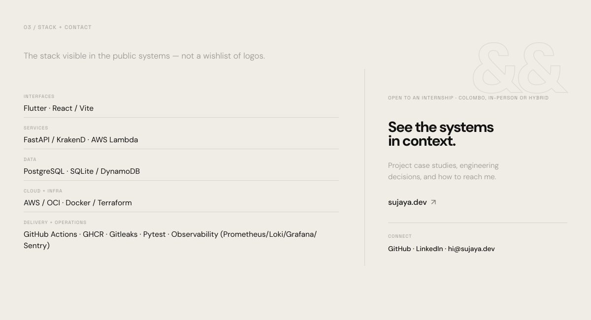

<a href="https://sujaya.dev">
  <picture>
    <source media="(prefers-color-scheme: dark)" srcset="./assets/hero-dark.svg">
    <source media="(prefers-color-scheme: light)" srcset="./assets/hero-light.svg">
    
  </picture>
</a>

Computer Science (Software Engineering) undergraduate building full-stack products and the cloud infrastructure they run on — Python, FastAPI, React, Flutter, AWS, and OCI. Open to an internship in Colombo, in-person or hybrid.

  

<a href="https://sujaya.dev/reclaima">
  <picture>
    <source media="(prefers-color-scheme: dark)" srcset="./assets/reclaima-dark.svg">
    <source media="(prefers-color-scheme: light)" srcset="./assets/reclaima-light.svg">
    
  </picture>
</a>

<a href="https://sujaya.dev/serverless-pipeline">
  <picture>
    <source media="(prefers-color-scheme: dark)" srcset="./assets/media-dark.svg">
    <source media="(prefers-color-scheme: light)" srcset="./assets/media-light.svg">
    
  </picture>
</a>

<a href="https://sujaya.dev">
  <picture>
    <source media="(prefers-color-scheme: dark)" srcset="./assets/stack-contact-dark.svg">
    <source media="(prefers-color-scheme: light)" srcset="./assets/stack-contact-light.svg">
    
  </picture>
</a>

  <a href="https://github.com/sujayamindev/reclaima">Reclaima source</a>
  &nbsp;&middot;&nbsp;
  <a href="https://github.com/sujayamindev/serverless-media-upload-pipeline">Media pipeline source</a>
  &nbsp;&middot;&nbsp;
  <a href="https://github.com/sujayamindev">GitHub</a>
  &nbsp;&middot;&nbsp;
  <a href="https://www.linkedin.com/in/sujayamindev">LinkedIn</a>
  &nbsp;&middot;&nbsp;
  <a href="mailto:hi@sujaya.dev">hi@sujaya.dev</a>

