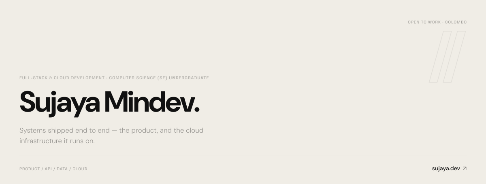
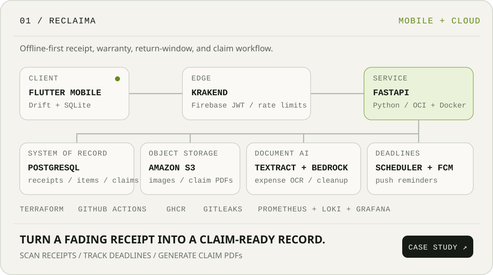
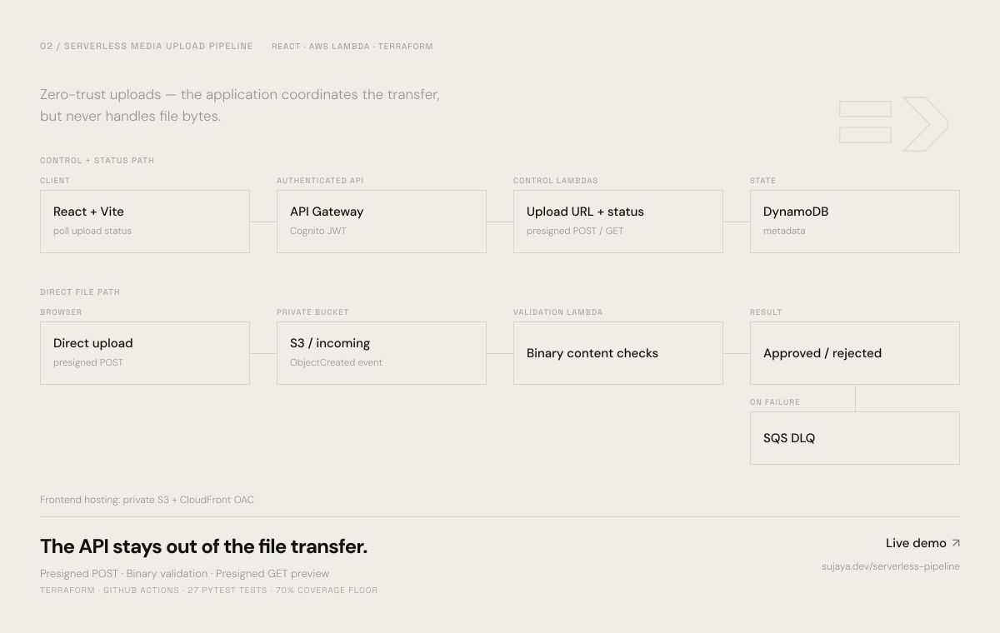
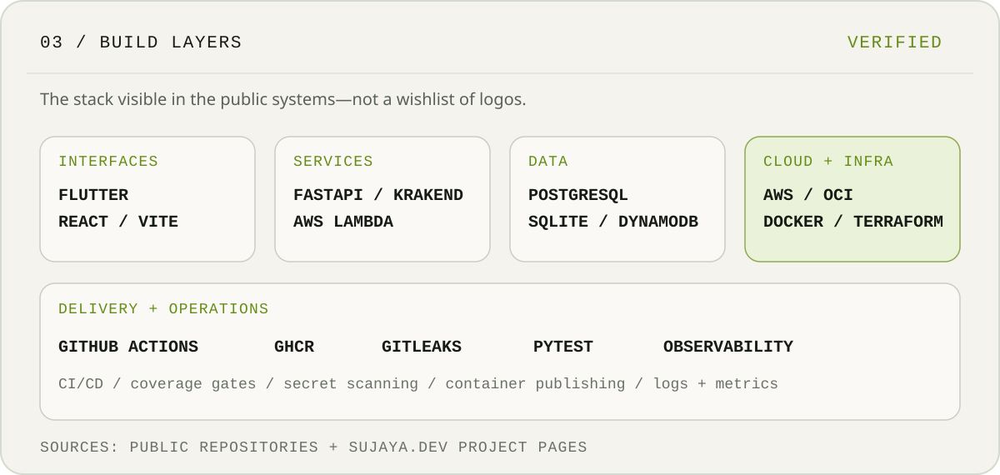
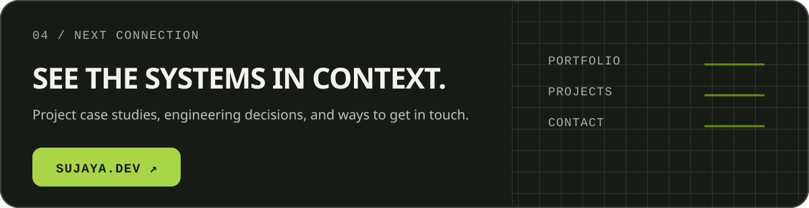

<picture>
  <source media="(prefers-color-scheme: dark)" srcset="./assets/hero-dark.svg">
  <source media="(prefers-color-scheme: light)" srcset="./assets/hero-light.svg">
  
</picture>

<a href="https://sujaya.dev/reclaima">
  <picture>
    <source media="(prefers-color-scheme: dark)" srcset="./assets/reclaima-dark.svg">
    <source media="(prefers-color-scheme: light)" srcset="./assets/reclaima-light.svg">
    
  </picture>
</a>

<a href="https://github.com/sujayamindev/serverless-media-upload-pipeline">
  <picture>
    <source media="(prefers-color-scheme: dark)" srcset="./assets/media-dark.svg">
    <source media="(prefers-color-scheme: light)" srcset="./assets/media-light.svg">
    
  </picture>
</a>

<picture>
  <source media="(prefers-color-scheme: dark)" srcset="./assets/stack-dark.svg">
  <source media="(prefers-color-scheme: light)" srcset="./assets/stack-light.svg">
  
</picture>

<a href="https://sujaya.dev">
  <picture>
    <source media="(prefers-color-scheme: dark)" srcset="./assets/contact-dark.svg">
    <source media="(prefers-color-scheme: light)" srcset="./assets/contact-light.svg">
    
  </picture>
</a>

  <a href="https://github.com/sujayamindev/reclaima">Reclaima source</a>
  &nbsp;&middot;&nbsp;
  <a href="https://github.com/sujayamindev/serverless-media-upload-pipeline">Media pipeline source</a>
  &nbsp;&middot;&nbsp;
  <a href="https://www.linkedin.com/in/sujayamindev">LinkedIn</a>

